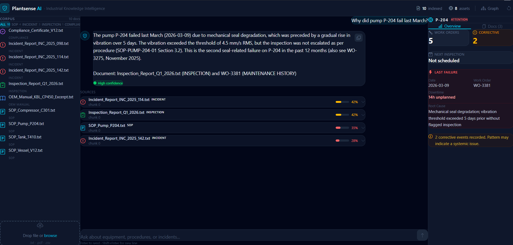

# Vigil AI — Industrial Knowledge Intelligence Platform

> *"Professionals in asset-intensive industries spend 35% of their working hours searching for information that already exists somewhere in the organisation."*
> — McKinsey Global Survey, 2024

Vigil AI makes that search instant — and makes the connections between documents visible for the first time.

---

## The Problem

A typical large Indian plant runs across 7–12 disconnected document systems. P&IDs in one folder. Maintenance work orders in another system. SOPs printed and filed. Inspection records in email attachments. Incident reports in a shared drive nobody searches.

The result: a maintenance engineer deciding whether to shut down a pump doesn't know that three months ago, an inspection report flagged a rising vibration trend on the same equipment class. That failure happens anyway. 18–22% of unplanned downtime in Indian heavy industry traces back to exactly this kind of fragmented knowledge.

Vigil AI solves this.

---

## What It Does

**Ask any operational question in plain English. Get a grounded answer with source citations.**

Vigil AI ingests SOPs, inspection reports, incident records, OEM manuals, compliance certificates, and structured maintenance work order history — then makes their collective intelligence queryable through a single conversational interface.



Every answer is:
- **Grounded** — pulled from specific document chunks, never hallucinated
- **Cited** — shows which document and section the answer came from, with a relevance score
- **Connected** — cross-references equipment history from structured work orders alongside unstructured document text in a single response
- **Confidence-scored** — High / Medium / Low based on retrieval similarity

---

## Demo — The P-204 Story

This is the narrative that shows what makes Vigil AI different from a generic PDF chatbot.

**Query:** *"Why did pump P-204 fail last March?"*

A generic search returns a list of documents. Vigil AI returns:

> *P-204 failed on 2026-03-09 due to mechanical seal degradation, preceded by a gradual rise in vibration over 5 days. The reading exceeded 4.5 mm/s RMS but was not escalated for inspection per SOP-PUMP-204-01 Section 3.2. This is the second seal-related failure in the past 12 months.*
> — Sources: Inspection_Report_Q1_2026.txt · SOP_Pump_P204.txt · WO-3381

No single person on that plant had connected those four documents. The inspection report, the SOP, the OEM manual, and the work order history all lived in different systems. Vigil AI connected them in 2 seconds.

**This is the knowledge cliff in action — and Vigil AI is the solution.**

---

## Five Demo Queries

| Query | What it demonstrates |
|-------|---------------------|
| `Why did pump P-204 fail last March?` | Cross-document RAG — 4 source types, 1 answer |
| `What does the SOP say about vibration limits?` | Procedural Q&A with direct SOP citation |
| `What caused C-301 to trip?` | Second storyline — seasonal failure pattern |
| `Is V-12 due for inspection?` | Compliance angle — PESO certificate chain |
| `What does the OEM manual recommend for seal monitoring?` | OEM knowledge retrieval |

---

## Architecture

```
User query (natural language)
        │
        ▼
  EmbeddingService          Cohere embed-english-light-v3.0
        │                   384-dimensional vectors
        ▼
  EmbeddingRepository       pgvector similarity search
        │                   HNSW index, cosine distance
        │                   top-5 most relevant chunks
        ▼
  RagService                Equipment tag detection
        │                   + SQL work order history lookup
        │                   + Context window assembly
        │                   + Groq llama-3.1-8b-instant call
        ▼
  ChatController            REST API + chat history persistence
        │
        ▼
  React Frontend            Chat UI · Source citations · Asset panel
                            Knowledge graph · Mobile responsive
```

### Key design decisions

**pgvector inside Postgres** — eliminates a separate vector database. One connection, one query can join similarity search results with structured work order history, joining unstructured and structured knowledge in a single SQL call.

**Hybrid retrieval** — vector similarity search over document chunks + SQL lookup over structured work order history per detected equipment tag. This is what allows the system to connect "the inspection report flagged a vibration trend" with "WO-3381 closed 5 days later with 14 hours downtime."

**Entity extraction at ingestion time** — equipment tags are indexed into a bridge table (`entity_mentions`) as each document is ingested, not re-scanned at query time. Cross-document lookup is instant regardless of corpus size.

**HNSW index** — approximate nearest-neighbour search, the correct choice over exact search for this use case. Scales to millions of vectors without degrading response time.

---

## Tech Stack

| Layer | Technology |
|-------|-----------|
| Frontend | React 18 + Vite + Tailwind CSS v4 + Bootstrap Icons |
| Backend | Java 21 + Spring Boot 3 + Spring Data JPA |
| Embeddings | Cohere `embed-english-light-v3.0` (384 dims) |
| LLM | Groq `llama-3.1-8b-instant` (fast inference, free tier) |
| Database | PostgreSQL + pgvector extension (Supabase) |
| Vector index | HNSW with cosine distance |

---

## Project Structure

```
vigil-ai/
├── frontend/                    React app (Vite)
│   └── src/
│       ├── api/api.js           All backend calls, documented
│       ├── components/
│       │   ├── chat/            Chat thread, messages, citations, input
│       │   ├── graph/           Interactive knowledge graph (SVG)
│       │   └── layout/          Corpus sidebar, asset panel, top strip
│       └── hooks/               useChat, useSession, useScrollToBottom
│
├── backend/                     Spring Boot REST API
│   └── src/main/java/
│       ├── controller/          Chat, Document, Ingestion endpoints
│       ├── service/             RagService, EmbeddingService, IngestionService
│       ├── repository/          JPA repos + EmbeddingRepository (native pgvector)
│       ├── entity/              Document, DocumentChunk, Equipment, WorkOrder...
│       └── seeder/              DataSeeder — auto-seeds corpus on startup
│
└── data/                        Synthetic industrial corpus
    ├── documents/               SOPs, inspection reports, incidents, OEM manuals
    └── structured/              equipment.csv, work_orders.csv
```

---

## Running Locally

### Prerequisites
- Java 21, Maven
- Node 18+
- [Supabase](https://supabase.com) free project
- [Cohere](https://dashboard.cohere.com) free API key
- [Groq](https://console.groq.com) free API key

### 1. Database

Run `backend/src/main/resources/db/migration/V1__init.sql` in your Supabase SQL Editor. This creates all tables and enables the pgvector extension.

### 2. Backend

```bash
cd backend

# Mac/Linux
export COHERE_API_KEY=your_key_here
export GROQ_API_KEY=your_key_here

# Windows
set COHERE_API_KEY=your_key_here
set GROQ_API_KEY=your_key_here

# Update application.properties with your Supabase connection string
mvn spring-boot:run
```

`DataSeeder` runs automatically on startup — populates all tables and generates embeddings for the synthetic corpus via Cohere.

### 3. Frontend

```bash
cd frontend
npm install
cp .env.example .env       # set VITE_API_URL=http://localhost:8080/api
npm run dev
```

Open `http://localhost:5173`

---

## Synthetic Corpus

The `data/` folder contains a carefully designed set of synthetic industrial documents where equipment IDs, dates, and failure patterns repeat consistently across document types — designed specifically to demonstrate cross-document retrieval.

**Four equipment storylines:**

| Equipment | Storyline | Documents involved |
|-----------|-----------|-------------------|
| P-204 | Recurring mechanical seal degradation — vibration precedes failure by 5 days, not escalated | SOP + OEM manual + Inspection report + 2 Incident reports + Work orders |
| C-301 | Seasonal cooling water strainer fouling — same failure mode two consecutive monsoon seasons | SOP + Incident report + Work orders |
| V-12 | PESO compliance certificate chain — overpressure protection, statutory inspection schedule | SOP + Compliance certificate + Work orders |
| T-410 | Level gauge calibration drift — instrument reliability, ambient temperature effect | SOP + Incident report + Work orders |

---

## Scalability Path

| Concern | Current (Hackathon) | Production path |
|---------|---------------------|-----------------|
| Documents | 12 synthetic files | Thousands — pgvector scales to millions of vectors |
| Embedding | Cohere free tier | Self-hosted model or enterprise API |
| LLM | Groq free tier | Dedicated inference or fine-tuned model |
| Auth | None | SSO with plant LDAP/AD |
| PDF ingestion | Apache Tika | Full OCR pipeline for scanned drawings |
| Real-time data | Not connected | DCS/SCADA integration via OPC-UA |

---

## Impact

- **35%** of engineer time currently spent searching for existing information (McKinsey, 2024)
- **18–22%** of unplanned downtime in Indian heavy industry linked to knowledge fragmentation (BIS Research)
- **25%** of experienced industrial engineers retiring within a decade — taking undocumented operational knowledge with them

Vigil AI addresses all three. Query time drops from hours to seconds. Failure patterns become visible across incident history. Expert knowledge is preserved in documents that outlast individual tenure.

---

## License

MIT